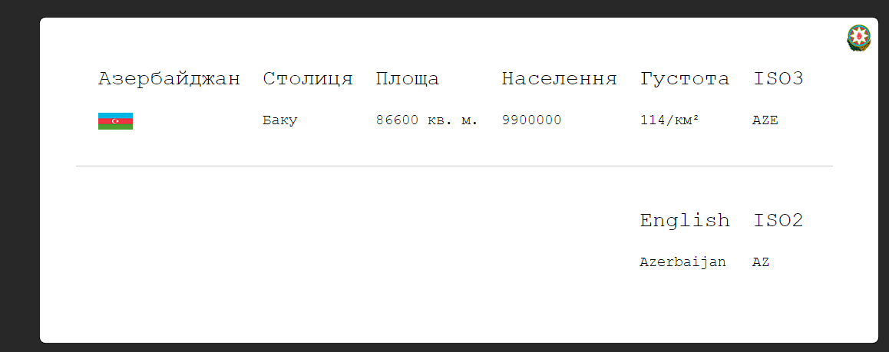
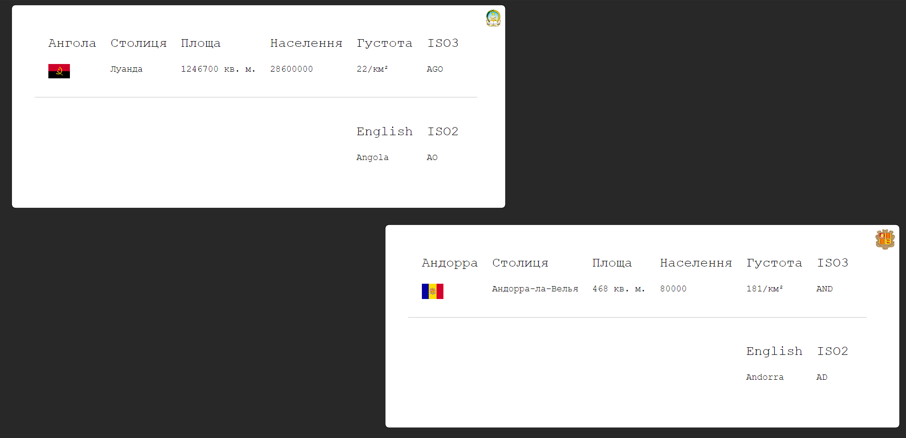

# WikiParser
 Project for Yury Yevtushenko's portfolio / Проект до портфоліо Юрія Євтушенка
 
 # Translations / Переклади 
 _________________
 
 #### Українська


### Трохи про проєкт📑

Цей проєкт розроблений для людей які хочать побачити, *у більш наочній формі*, базові знання про усі країни світу. [Приклад](#Приклад). Картки генерується для кожної країни, дані автоматично беруться з **wikipedia**

### Усі дані парсяться з https://wikipedia.org/

#### Веб-Фреймворк:
- Nuxt3 + Vue

#### Для парсингу:
- Axios
- Cheerio

##### Автор: Юрій (k5sha) Євтушенко

### Встановлення та запуск 📃
| Назва  | Скачати  | 
|---|---|
| 1. Скачуємо архів та разпоковуємо 📚|  [Тиць](/k5sha/WikiParser/archive/refs/heads/main.zip "Скачати Архів") | 
| 2. Скачуємо node.js v18 🧶   |  [Тиць](https://nodejs.org/uk/ "Скачати Node.js") |

Тепер трохи коду
```
cd ./(ШляхДоПроєкту)
npm i
npm run dev
```
Повино вийти щось на плані такого:
```
Nuxi 3.0.0                                                                                                                   21:43:50
Nuxt 3.0.0 with Nitro 1.0.0                                                                                                  21:43:50
                                                                                                                             21:43:52
  > Local:    http://localhost:3000/
  > Network:  http://192.168.0.105:3000/

                                                                                                                             21:43:50  
 ERROR  (node:7452) ExperimentalWarning: The Fetch API is an experimental feature. This feature could change at any time     21:43:52
(Use `node --trace-warnings ...` to show where the warning was created)

i Vite client warmed up in 1469ms                                                                                            21:43:56
√ Nitro built in 844 ms                                                                                                nitro 21:43:57

```
* Якщо якась помилка створюйте запитання у  `Issues`

Далі заходемо у `Браузер` і вбиваємо таку адресу `http://localhost:3000/`

Усе готово:3

### Приклади
## `Картки країн` 🗺


